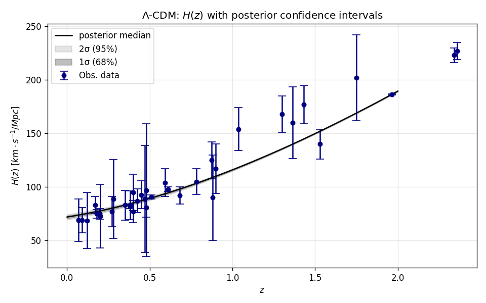

# Bayesian MCMC for cosmology


[](LICENSE)


**Monte Carlo methods for Bayesian inference: a from-scratch Metropolis–Hastings
test of dark energy evolution.**

A hand-written Metropolis–Hastings sampler is used to fit the cosmic expansion
rate $H(z)$ and to ask a concrete question: **do the data require *dynamical*
dark energy, or is a cosmological constant enough?** The cosmology is the
application; the focus is correct Bayesian inference and rigorous MCMC
diagnostics.



## Results

Fitting **ΛCDM** to 36 cosmic-chronometer + BAO $H(z)$ measurements
(Yu, Ratra & Wang 2018):

| Parameter | Posterior (mean ± 1σ) |
|-----------|-----------------------|
| $H_0$     | **71.9 ± 1.4** km s⁻¹ Mpc⁻¹ |
| $\Omega_m$ | **0.229 ± 0.010** |
| $\chi^2/\mathrm{dof}$ | 0.68 |

Sampling used **16 chains**; all parameters converged (Gelman–Rubin
$\hat{R} < 1.02$).

### Does the data justify dynamical dark energy?

Comparing ΛCDM against the **CPL** ($w_0$–$w_a$) dynamical dark-energy model:

| Model | k | χ²/dof | AIC | BIC | ΔBIC |
|-------|---|--------|-----|-----|------|
| **ΛCDM** | 2 | 0.68 | 26.98 | **30.15** | 0.00 |
| CPL   | 4 | 0.63 | 28.11 | 34.44 | **+4.29** |

CPL lowers $\chi^2$ only marginally — not enough to pay for its two extra
parameters. **ΔBIC ≈ +4.3 favours ΛCDM: the data do not justify dynamical dark
energy.** With this small $H(z)$ sample the CPL equation-of-state parameters
$(w_0, w_a)$ are essentially unconstrained (a strongly degenerate posterior),
consistent with the need for combined probes (BAO + CMB + SNe) to break the
degeneracy.

## Method

- **Data** — 36 cosmic-chronometer and BAO $H(z)$ points, `data/hubble_cosmic_chronometers.txt`.
- **Sampler** — random-walk Metropolis–Hastings written from scratch
  (`src/mcmc/sampler.py`), in log-likelihood space for numerical stability, with
  burn-in, acceptance tracking, and uniform-prior bounds. CPL's degenerate
  posterior is sampled with a **preconditioned proposal** (covariance estimated
  from a pilot run).
- **Convergence** — many-chain **Gelman–Rubin** $\hat{R}$ (with running-$\hat{R}$
  and trace diagnostics).
- **Model selection** — best-fit $\chi^2$, **AIC** and **BIC**
  (`src/mcmc/inference.py`).

## Repository layout

```
src/mcmc/                 # reusable package
  ├── models.py           # ΛCDM, CPL (w0-wa) H(z) models
  ├── inference.py        # chi², likelihood, best-fit, AIC/BIC
  ├── sampler.py          # Metropolis–Hastings, multi-chain, Gelman–Rubin
  └── plotting.py         # traces, R-hat, H(z) band, credible-region marginals
data/                     # H(z) measurements
figures/                  # generated figures
tests/                    # unit tests for the sampler and inference
main.ipynb   # narrated end-to-end demonstration
```

## Usage

```bash
pip install -r requirements.txt
python -m pytest tests/          # run the unit tests
jupyter notebook main.ipynb
```

## Reference

Yu, H., Ratra, B., & Wang, F. Y. (2018). *Hubble parameter and Baryon Acoustic
Oscillation measurement constraints on the Hubble constant, the deviation from
the spatially flat ΛCDM model, the deceleration–acceleration transition
redshift, and spatial curvature.* The Astrophysical Journal, 856(1), 3.
